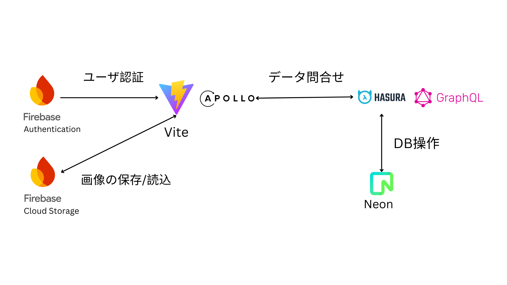
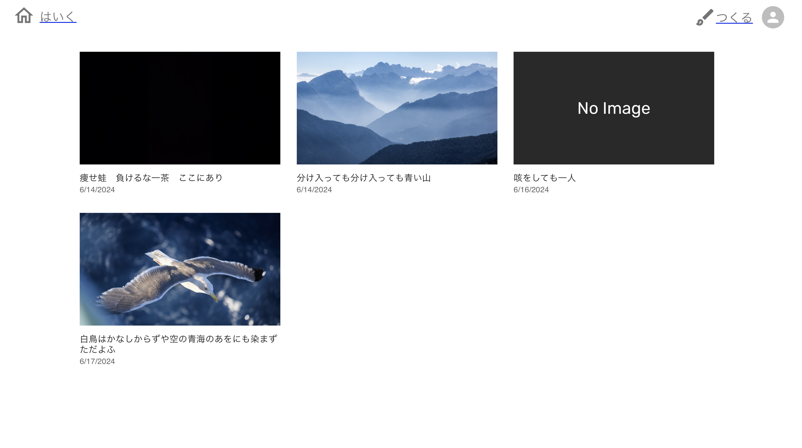

# haiku-post

## 概要

[haiku-post](https://haiku-post-2jef4dm1v-graspantas-projects.vercel.app/)は、俳句投稿サービスです。

<figure>
  <figcaption>サーバ構成図</figcaption>
  
</figure>

<figure>
  <figcaption>ホーム画面</figcaption>
  
</figure>

## 機能一覧

- ユーザ登録
- ユーザログイン
- 俳句投稿
- 画像アップロード
- マイページ

## 開発環境

<table>
  <tr>
    <td>言語</td>
    <td>TypeScript 5.2.2</td>
  </tr>
   <tr>
    <td>データベース</td>
    <td>PostgreSQL 15.7</td>
  </tr>
  <tr>
    <td>フレームワーク</td>
    <td>Vite 5.2.0, Material UI 5.15.19</td>
  </tr>
  <tr>
    <td>サービス</td>
    <td>Firebase, Hasura</td>
  </tr>
   <tr>
    <td>主なライブラリ</td>
    <td>Apollo Client 3.10.4, GraphQL 16.8.1</td>
  </tr>
</table>
